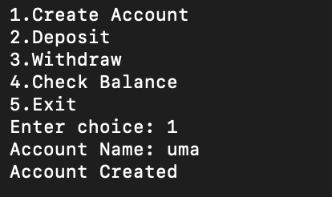
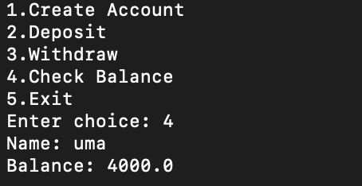

# Smart Banking System

## Overview
A Python-based banking management system that allows users to:
- Create accounts
- Deposit money
- Withdraw money
- Check account balance

## Technologies Used
- Python
- Data Structures
- OOP Concepts

## Features
- Account Management
- Deposit and Withdrawal
- Balance Tracking
- Transaction Processing
- ## Screenshots

### Create Account

### Deposit

### Withdraw

### Check Balance

